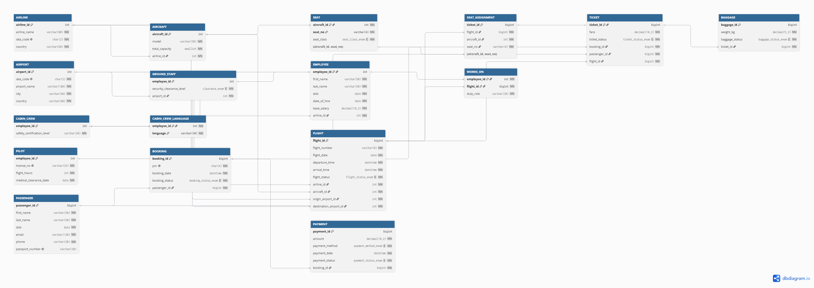

# Airline Management System — Database Design

A relational database for an airline management system, designed from a
conceptual ER model through to a normalized, constraint-enforced MySQL
schema.


## Highlights

- 14 entities, including a weak entity, a ternary relationship, and a
  disjoint total specialization
- 17 relations, 16 proven to be in BCNF
- Triggers and transactions enforcing rules foreign keys alone can't
- 24 different types of queries

## Relational Model


## Repository structure

```
├── ER_Diagrams/        Chen-notation ER diagram (.png, .svg)
├── Relational Model/   Relational schema diagram + normalization proofs
├── Database Scripts/   Tables, triggers, transactions
├── Sample Data/        Seed data
└── Queries/            Analytical queries
```

## How to run

Execute in MySQL Workbench in this order:

```
Database Scripts/airline_management_system_tables.sql
Database Scripts/triggers.sql
Database Scripts/transactions.sql
Sample Data/airline_sample_data.sql
Queries/queries_1.sql
Queries/queries_2.sql
```

## Tech

- Dia (ER diagram) 
- dbdiagram.io (relational model) 
- MySQL 8